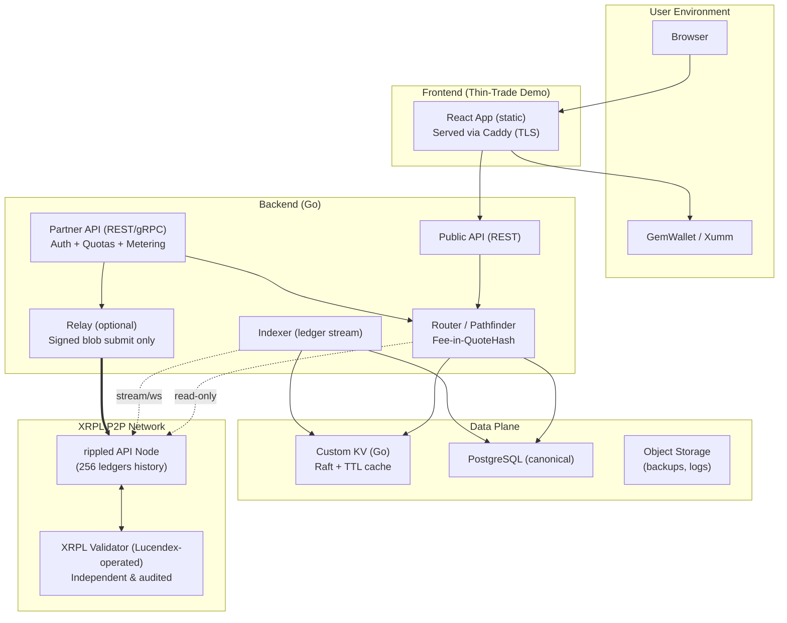

## Architecture & Build Plan (Neutral-Infra v1)

This document is the current architecture for LucenDEX's **neutral infrastructure + thin-trade bootstrap UI** strategy.

---

### A. Core Changes vs. Original Draft

1. **Relay is optional by default**

   * Default flow: wallet signs **and submits directly** to `rippled`.
   * Relay exists only as a convenience forwarder for **signed blobs**. No keys, ever.
   * Config: `RELAY_ENABLED=false` by default.

2. **Partner API front door (auth + quotas + metering)**

   * Add `/partner/*` endpoints gated by API-key + request signing (Ed25519) and optional mTLS for premium.
   * Per-partner rate limits in KV.
   * Usage metering to a minimal `usage_events` table for billing and SLOs.

3. **Public vs Partner surfaces**

   * `/public/*` = low-risk read + demo trade quote.
   * `/partner/*` = authenticated, higher limits, SLA-grade.

4. **Deterministic fee injection**

   * Router adds a small **routing fee (bps)**; included in the quote and the **QuoteHash** so it's tamper-evident.

5. **UI remains thin-trade demo**

   * No LP UI, no listings admin, no charts in V1.
   * Prominent label: *"Demo client — production partners use the Partner API"*.

---

### B. Updated Component Diagram (Mermaid)



---

### C. Partner API: Auth, Quotas, Metering

**Auth headers (Ed25519 request signing):**

```
X-Partner-Id: <uuid>
X-Request-Id: <uuid>
X-Timestamp: <RFC3339>
X-Signature: base64(Ed25519(sign(canonical_request)))
```

* Canonical request = method + path + query + body SHA256 + timestamp.
* Optional mTLS for premium plans.

**Quota keys in KV (examples):**

```
rl:partner:{id}:{bucket} -> counter (TTL window)
partner:plan:{id}        -> cached plan info (TTL)
quote:{hash}             -> serialized route (TTL)
```

**DB additions:**

```sql
CREATE TABLE partners(
  id UUID PRIMARY KEY,
  name TEXT NOT NULL,
  plan TEXT NOT NULL,         -- free, pro, enterprise
  status TEXT NOT NULL,       -- active, suspended
  created_at TIMESTAMPTZ NOT NULL DEFAULT now()
);

CREATE TABLE api_keys(
  id UUID PRIMARY KEY,
  partner_id UUID REFERENCES partners(id),
  public_key TEXT NOT NULL,   -- Ed25519
  label TEXT,
  created_at TIMESTAMPTZ NOT NULL DEFAULT now(),
  revoked BOOLEAN DEFAULT FALSE
);

CREATE TABLE usage_events(
  id BIGSERIAL PRIMARY KEY,
  partner_id UUID REFERENCES partners(id),
  ts TIMESTAMPTZ NOT NULL DEFAULT now(),
  kind TEXT NOT NULL,         -- quote, submit, orderbook, route
  units INT NOT NULL,
  route_bps NUMERIC,
  meta JSONB
);
```

---

### D. API Surfaces (delta)

**Public**

* `GET /public/v1/pairs`
* `GET /public/v1/orderbook?base=XRP&quote=USD.rXYZ...`
* `POST /public/v1/quote` → `QuoteResp`

**Partner (auth required)**

* `POST /partner/v1/quote` → `QuoteResp` (higher limits, SLA)
* `POST /partner/v1/submit` → `{ tx_hash }` (signed blob only)
* `GET  /partner/v1/usage` → usage metering summary
* `GET  /partner/v1/health` → indexer freshness, router cache age, rippled lag

**Quote struct (with fee):**

```go
type Fees struct {
    RouterBps int
    EstOutFee Decimal
}

type QuoteResp struct {
    Route       Route
    Out         Decimal
    Price       Decimal
    Fees        Fees
    LedgerIndex uint32
    QuoteHash   [32]byte
    TTLLedgers  uint16
}
```

* `HashQuote` must include `Fees` fields in the canonical hash input.

---

### E. XRPL Validator Infrastructure

Lucendex will operate **one independent XRPL validator**, complementing its rippled nodes.

**Objectives:**

* Contribute to XRPL decentralization and transparency.
* Enable cryptographically signed ledger checkpoints for audit artifacts.
* Provide low-latency ledger data and reduce dependency on public nodes.

**Setup:**

| Component                | Purpose                               | Hosting                     | Security Notes                                     |
| ------------------------ | ------------------------------------- | --------------------------- | -------------------------------------------------- |
| `rippled` (API Node)     | Ledger sync + read ops + indexer feed | Cloud VM / bare metal       | RPC restricted to internal network, 256 ledger history |
| `Validator`              | Ledger validation + signing           | Separate provider or region | Offline keypair, validator token rotated quarterly |
| `Monitoring`             | Metrics, lag detection, desync alerts | Prometheus + Grafana        | Self-healing ops via agent scripts                 |

**Cost Model (monthly est.):**

| Item                         | Est. Cost (USD)      |
| ---------------------------- | -------------------- |
| Compute (16 vCPU / 64GB RAM) | $96                  |
| Storage (400GB SSD)          | $0 (included)        |
| Bandwidth (1–2 TB)           | $0 (included)        |
| Monitoring & backups         | $10–20               |
| **Total**                    | **≈ $106–116/month** |

**Resource Allocation (64GB total):**
- rippled API Node: 40GB RAM, 8 CPUs (tip-following, 256 ledger history)
- PostgreSQL: 5GB RAM (AMM pools, orderbook state, completed trades)
- Router: 3GB RAM (quote engine + KV cache)
- Indexer: 1GB RAM (ledger stream processor)
- System Buffer: ~15GB RAM (OS, cache, overhead)

Validator metrics integrate with the Partner API’s `/health` endpoint, so partner systems can assess **ledger freshness** and **validator participation** in real time.

---

### F. Security & Ops Additions

* Relay off by default; direct wallet submit is the recommended path.
* Per-partner SLO metrics (Prometheus labels by `partner_id`).
* Synthetic canary checks (quote + verify) every minute per critical market.
* Geofencing hook at API edge; no PII in logs, only `partner_id` for metering.
* Separate ingress: `api.lucendex.com` (partner) vs `demo.lucendex.com` (public).

---

### G. Revised Milestones (focused)

* **M0:** rippled node + indexer streaming (no UI yet)
* **M1:** DB schema + router quoting + deterministic fees
* **M2:** Public endpoints + thin-trade demo (wallet sign & direct submit)
* **M3:** Partner API (auth, quotas, metering, SLOs); relay optional-only
  * **On-Demand Order Verification**: Partners submit `ledger_index` + `tx_hash` for executed trades
  * Backend verifies transaction exists in XRPL via rippled API
  * Stores verified partner orders in `partner_orders` table for compliance
  * Enables selective backfill: only fetch specific ledgers when needed for partner disputes
* **M4:** XRPL validator live + health metrics integration
* **M5:** 2 pilot integrations (wallet + fund); polish ops

---

### H. Future Hardening (Post-Research Phase)

**Single API Node Architecture**

The indexer connects to a single tip-following rippled API node (256 ledger history). This design provides:

* **Simplicity**: Single WebSocket connection, no consensus overhead
* **Low latency**: Direct access to validated ledger stream
* **Cost efficiency**: One node vs multiple nodes ($160/mo vs $500+/mo)
* **Sufficient for V1**: XRPL network already provides BFT guarantees

**Trade Tracking Scope**:
* Indexes current state only (AMM pools, active orderbook offers)
* Tracks Lucendex-executed trades via QuoteHash in memo
* 90-day retention for completed trades
* Database stays <1GB with current design

**Future Considerations**:
* Multi-node verification if required by partners
* Add history node only if gap-fill becomes necessary
* Current 256-ledger buffer sufficient for indexer restarts

---

### I. M1 Security Architecture (Router + KV Store)

**Security-First Implementation**: M1 implements router and KV store with zero-trust principles and no technical debt.

#### 1. KV Store Security Model

**Namespace Isolation**

All KV operations enforce namespace-level access control:

```go
type Store interface {
    // Namespaced operations prevent cross-contamination
    Get(namespace, key string) ([]byte, bool)
    Set(namespace, key string, value []byte, ttl time.Duration) error
    Delete(namespace, key string) error
    
    // Specialized operations with built-in authorization
    IncrementRateLimit(partnerID string, ttl time.Duration) (int64, error)
    GetQuote(hash [32]byte) (*SerializedRoute, error)
    SetQuote(hash [32]byte, route *SerializedRoute, ttl time.Duration) error
}
```

**Namespaces:**
- `quotes` - Quote cache (router-only write, API read)
- `rate_limits` - Partner quotas (rate limiter-only)
- `circuit_breaker` - Breaker state (router-only)

**Memory Limits & DoS Prevention**

```go
type MemoryStore struct {
    maxBytes      int64  // 512MB default
    currentBytes  int64  // Atomic counter
    maxKeyLength  int    // 256 bytes
    maxValueSize  int    // 1MB per entry
    evictionPolicy string // LRU
}
```

**Protection mechanisms:**
- LRU eviction when memory limit reached
- Per-namespace quotas (quotes: 10k, rate_limits: 100k max keys)
- Key length validation (max 256 bytes)
- Value size limits (max 1MB per entry)
- Exponential backoff for failed operations

**Key Validation Rules**

```go
func validateKey(namespace, key string) error {
    if len(key) > MaxKeyLength {
        return ErrKeyTooLong
    }
    if !keyRegex.MatchString(key) {
        return ErrInvalidKeyFormat
    }
    if namespace == "" {
        return ErrMissingNamespace
    }
    return nil
}
```

#### 2. mTLS Database Connections

**Zero-Trust Network Architecture**

All database connections use mTLS with mutual authentication:

```go
// PostgreSQL connection with mTLS
connStr := fmt.Sprintf(
    "postgres://router_ro@%s/%s?"+
    "sslmode=verify-full&"+
    "sslcert=%s&"+
    "sslkey=%s&"+
    "sslrootcert=%s",
    dbHost, dbName,
    certPath,     // /opt/lucendex/certs/router-client.crt
    keyPath,      // /opt/lucendex/certs/router-client.key
    caPath,       // /opt/lucendex/certs/ca.crt
)
```

**Certificate Management**
- Short-lived certificates (24-hour TTL)
- Automatic rotation via systemd timer
- Separate cert per service (router, indexer, API)
- Internal CA for certificate issuance

**Credential Injection**
- Vault integration for production
- Environment variable fallback for development
- Never log connection strings
- Support hot reload on credential rotation

#### 3. Rate Limit Persistence

**Dual-Layer Architecture**

PostgreSQL as source of truth, KV as cache:

```sql
-- metering.rate_limits - Authoritative data
CREATE TABLE metering.rate_limits (
    partner_id UUID NOT NULL,
    bucket BIGINT NOT NULL,        -- unix timestamp / window size
    count INT NOT NULL,
    expires_at TIMESTAMPTZ NOT NULL,
    PRIMARY KEY (partner_id, bucket)
);

CREATE INDEX idx_rate_limits_expires ON metering.rate_limits(expires_at);
```

**Flow:**

1. Request arrives → check KV cache
2. If hit: validate against cached quota
3. If miss: load from PostgreSQL → cache in KV
4. Increment counter (atomic)
5. Every 10 increments: sync to PostgreSQL
6. On restart: reload active quotas from DB

**Restart Resilience**

```go
// On startup, restore rate limits
func (s *Store) RestoreRateLimits(ctx context.Context) error {
    rows, err := s.db.QueryContext(ctx, `
        SELECT partner_id, bucket, count, expires_at
        FROM metering.rate_limits
        WHERE expires_at > now()
    `)
    // Load into KV cache
}
```

#### 4. QuoteHash Replay Prevention

**Used Quotes Tracking**

```sql
-- metering.used_quotes - Prevent quote reuse
CREATE TABLE metering.used_quotes (
    quote_hash BYTEA PRIMARY KEY,
    ledger_index BIGINT NOT NULL,
    used_at TIMESTAMPTZ NOT NULL DEFAULT now(),
    partner_id UUID,
    tx_hash TEXT
);

CREATE INDEX idx_used_quotes_expires ON metering.used_quotes(used_at);
CREATE INDEX idx_used_quotes_partner ON metering.used_quotes(partner_id);
```

**Verification Flow**

```go
func (r *Router) ValidateQuote(hash [32]byte, ledgerIndex uint32) error {
    // 1. Check if already used
    exists := r.store.QuoteUsed(hash)
    if exists {
        return ErrQuoteAlreadyUsed
    }
    
    // 2. Verify TTL not expired
    quote := r.kv.GetQuote(hash)
    if ledgerIndex > quote.TTL {
        return ErrQuoteExpired
    }
    
    // 3. Mark as used (idempotent)
    r.store.MarkQuoteUsed(hash, ledgerIndex, partnerID)
    
    return nil
}
```

**Cleanup Job**

```go
// Run every hour, delete quotes older than max TTL
func cleanupUsedQuotes() {
    DELETE FROM metering.used_quotes 
    WHERE used_at < now() - interval '1 hour'
}
```

#### 5. Circuit Breaker Persistence

**Stateful Circuit Breaker**

```sql
-- metering.circuit_breaker_state
CREATE TABLE metering.circuit_breaker_state (
    pair TEXT PRIMARY KEY,                    -- e.g., "XRP-USD.rXYZ"
    recent_prices JSONB NOT NULL,            -- Last 100 trades
    last_trade_ts TIMESTAMPTZ,
    state TEXT NOT NULL DEFAULT 'closed',    -- closed, open, half-open
    failures INT DEFAULT 0,
    updated_at TIMESTAMPTZ NOT NULL DEFAULT now()
);

CREATE INDEX idx_breaker_updated ON metering.circuit_breaker_state(updated_at);
```

**Startup Caution Mode**

```go
func (r *Router) Initialize() error {
    // Load previous state
    r.loadCircuitBreakerState()
    
    // Start in "caution mode" for 60 seconds
    r.cautionMode = true
    r.cautionMultiplier = 0.5  // 50% tighter limits
    
    time.AfterFunc(60*time.Second, func() {
        r.cautionMode = false
    })
    
    return nil
}
```

**State Persistence**

```go
// Persist every 30 seconds
func (r *Router) persistBreakerState() {
    ticker := time.NewTicker(30 * time.Second)
    for range ticker.C {
        r.store.SaveBreakerState(r.breakers)
    }
}
```

#### 6. Audit Logging (Compliance-Grade)

**Structured Audit Events**

```sql
-- metering.router_audit
CREATE TABLE metering.router_audit (
    id BIGSERIAL PRIMARY KEY,
    ts TIMESTAMPTZ NOT NULL DEFAULT now(),
    event TEXT NOT NULL,              -- quote_request, circuit_break, validation_error
    partner_id UUID,
    severity TEXT,                    -- info, warn, error, critical
    duration_ms INT,
    metadata JSONB,                   -- No PII, hashed identifiers only
    outcome TEXT                      -- success, rejected, error
);

CREATE INDEX idx_router_audit_ts ON metering.router_audit(ts);
CREATE INDEX idx_router_audit_partner ON metering.router_audit(partner_id);
CREATE INDEX idx_router_audit_event ON metering.router_audit(event);
```

**Logging Rules**

```go
// Log every quote request
type QuoteAuditLog struct {
    Event      string    `json:"event"`
    PartnerID  string    `json:"partner_id"`
    In         string    `json:"in"`
    Out        string    `json:"out"`
    AmountHash string    `json:"amount_hash"`  // SHA256 of amount (no exact values)
    QuoteHash  string    `json:"quote_hash"`
    DurationMs int       `json:"duration_ms"`
    Outcome    string    `json:"outcome"`
}

// NO PII - Hash sensitive data
func hashAccount(addr string) string {
    h := sha256.Sum256([]byte(addr))
    return hex.EncodeToString(h[:8])  // First 8 bytes
}
```

**Log Rotation & Retention**
- Rotate daily via logrotate
- Retain 90 days for compliance
- Archive to encrypted object storage
- No sensitive data in logs (no amounts, no IPs in router logs)

#### 7. Input Validation

**QuoteRequest Validation**

```go
func ValidateQuoteRequest(req *QuoteRequest) error {
    // Amount bounds
    if req.Amount.LessThanOrEqual(decimal.Zero) {
        return ErrInvalidAmount
    }
    if req.Amount.GreaterThan(decimal.NewFromInt(1e18)) {
        return ErrAmountTooLarge  // Prevent overflow
    }
    
    // Asset validation
    if !isValidXRPLAsset(req.In) {
        return ErrInvalidInAsset
    }
    if !isValidXRPLAsset(req.Out) {
        return ErrInvalidOutAsset
    }
    if req.In == req.Out {
        return ErrSameAssets
    }
    
    // Sanity checks
    if req.In == "" || req.Out == "" {
        return ErrMissingAsset
    }
    
    return nil
}

func isValidXRPLAsset(asset string) bool {
    // XRP or currency.issuer format
    if asset == "XRP" {
        return true
    }
    parts := strings.Split(asset, ".")
    if len(parts) != 2 {
        return false
    }
    currency, issuer := parts[0], parts[1]
    return len(currency) == 3 && isValidXRPLAddress(issuer)
}
```

**Request Size Limits**

```go
const (
    MaxRequestBodySize = 1024 * 1024  // 1MB
    MaxAssetLength     = 64
    MaxPartnersPerIP   = 100
)
```

#### 8. Additional Database Security

**Extended Schema**

```sql
-- Add to existing migrations

-- 006_router_security.sql
CREATE SCHEMA IF NOT EXISTS metering;

CREATE TABLE metering.rate_limits (
    partner_id UUID NOT NULL,
    bucket BIGINT NOT NULL,
    count INT NOT NULL,
    expires_at TIMESTAMPTZ NOT NULL,
    PRIMARY KEY (partner_id, bucket)
);

CREATE TABLE metering.used_quotes (
    quote_hash BYTEA PRIMARY KEY,
    ledger_index BIGINT NOT NULL,
    used_at TIMESTAMPTZ NOT NULL DEFAULT now(),
    partner_id UUID,
    tx_hash TEXT
);

CREATE TABLE metering.circuit_breaker_state (
    pair TEXT PRIMARY KEY,
    recent_prices JSONB NOT NULL,
    last_trade_ts TIMESTAMPTZ,
    state TEXT NOT NULL DEFAULT 'closed',
    failures INT DEFAULT 0,
    updated_at TIMESTAMPTZ NOT NULL DEFAULT now()
);

CREATE TABLE metering.router_audit (
    id BIGSERIAL PRIMARY KEY,
    ts TIMESTAMPTZ NOT NULL DEFAULT now(),
    event TEXT NOT NULL,
    partner_id UUID,
    severity TEXT,
    duration_ms INT,
    metadata JSONB,
    outcome TEXT
);

-- Indexes for performance
CREATE INDEX idx_rate_limits_expires ON metering.rate_limits(expires_at);
CREATE INDEX idx_used_quotes_expires ON metering.used_quotes(used_at);
CREATE INDEX idx_used_quotes_partner ON metering.used_quotes(partner_id);
CREATE INDEX idx_breaker_updated ON metering.circuit_breaker_state(updated_at);
CREATE INDEX idx_router_audit_ts ON metering.router_audit(ts);
CREATE INDEX idx_router_audit_partner ON metering.router_audit(partner_id);

-- Cleanup jobs
CREATE OR REPLACE FUNCTION cleanup_expired_rate_limits()
RETURNS void AS $$
BEGIN
    DELETE FROM metering.rate_limits WHERE expires_at < now();
END;
$$ LANGUAGE plpgsql;

CREATE OR REPLACE FUNCTION cleanup_used_quotes()
RETURNS void AS $$
BEGIN
    DELETE FROM metering.used_quotes WHERE used_at < now() - interval '1 hour';
END;
$$ LANGUAGE plpgsql;
```

**Row-Level Security**

```sql
-- Enable RLS for multi-tenant isolation
ALTER TABLE metering.rate_limits ENABLE ROW LEVEL SECURITY;
ALTER TABLE metering.used_quotes ENABLE ROW LEVEL SECURITY;
ALTER TABLE metering.router_audit ENABLE ROW LEVEL SECURITY;

-- Policy: Router can read/write its own data
CREATE POLICY router_rate_limits ON metering.rate_limits
    FOR ALL TO router_ro
    USING (true);  -- Router sees all (read-only role)

-- Policy: Partners can only see their own audit logs
CREATE POLICY partner_audit ON metering.router_audit
    FOR SELECT TO api_ro
    USING (partner_id::text = current_setting('lucendex.partner_id', true));
```

#### 9. Security Testing Requirements

**Test Coverage: 90%+ for Security-Critical Paths**

Required test suites:

```go
// internal/kv/security_test.go
func TestMemoryExhaustionProtection(t *testing.T)
func TestNamespaceIsolation(t *testing.T)
func TestConcurrentAccessSafety(t *testing.T)
func TestLRUEviction(t *testing.T)
func TestKeyValidation(t *testing.T)

// internal/router/security_test.go
func TestInputValidationBypass(t *testing.T)
func TestQuoteReplayPrevention(t *testing.T)
func TestRateLimitManipulation(t *testing.T)
func TestCircuitBreakerTampering(t *testing.T)
func TestSQLInjectionAttempts(t *testing.T)
func TestCredentialExposure(t *testing.T)

// internal/router/breaker_test.go
func TestBreakerStateRestoration(t *testing.T)
func TestCautionModeEnforcement(t *testing.T)
func TestConcurrentBreakerUpdates(t *testing.T)
```

#### 10. Operational Security Hooks

**Incident Response Integration**

```go
// Degraded mode triggers
type AlertCondition struct {
    Name      string
    Threshold float64
    Action    func()
}

var alerts = []AlertCondition{
    {
        Name: "RateLimitBypassAttempt",
        Threshold: 10,  // 10 bypasses in 1 minute
        Action: func() {
            // Enable stricter validation
            router.EnableStrictMode()
            // Alert ops team
            metrics.IncrementAlert("rate_limit_bypass")
        },
    },
    {
        Name: "DatabaseLatencySpike",
        Threshold: 500,  // 500ms
        Action: func() {
            // Switch to read-only mode
            router.EnableReadOnly()
        },
    },
}
```

**Circuit Breaker Metrics**

```go
// Prometheus metrics
var (
    quotesGenerated = prometheus.NewCounterVec(
        prometheus.CounterOpts{
            Name: "lucendex_quotes_generated_total",
        },
        []string{"outcome"},  // success, circuit_break, validation_error
    )
    
    circuitBreakerState = prometheus.NewGaugeVec(
        prometheus.GaugeOpts{
            Name: "lucendex_circuit_breaker_state",
        },
        []string{"pair", "state"},  // closed=0, open=1, half_open=2
    )
)
```

---

**M1 Security Checklist**

Before deployment:

- [ ] KV namespace isolation tested (100+ concurrent goroutines)
- [ ] Memory limits enforced (DoS protection verified)
- [ ] mTLS connections established (certificate validation working)
- [ ] Rate limits persist across restarts (PostgreSQL + KV sync)
- [ ] Quote replay prevention active (used_quotes tracking)
- [ ] Circuit breaker state survives restarts
- [ ] Audit logs capture all events (no PII)
- [ ] Input validation prevents all bypass attempts
- [ ] SQL injection tests pass (parameterized queries only)
- [ ] Credential exposure tests pass (no secrets in errors/logs)
- [ ] Security test coverage ≥90%
- [ ] Incident response hooks integrated

---

## Why Not Native `path_find`?

Native `path_find` is a useful primitive but does not provide partner-grade guarantees.

| Capability | Native `path_find` | LucenDEX |
|-----------|-------------------|---------|
| Circuit breakers | ❌ | ✅ Price anomaly detection + auto-pause |
| Quote binding | ❌ | ✅ blake2b-256 QuoteHash |
| Replay prevention | ❌ | ✅ used_quotes tracking |
| Rate limits + SLAs | ❌ | ✅ Per-partner quotas + metering |
| Compliance audit trail | ❌ | ✅ 90-day retention, no PII |

LucenDEX wraps XRPL primitives into **deterministic infrastructure** that partners can rely on.

---

## XRPL 3.1.0 Alignment

XRPL 3.1.0 introduces LendingProtocol (XLS-66). This is a **Phase 2** opportunity:

- Atomic leveraged swaps using protocol-native primitives
- Market maker inventory funding
- Institutional margin workflows

LucenDEX treats LendingProtocol as optional and **guardrail-only**: QuoteHash binding, circuit breakers, and partner-only exposure remain mandatory.
